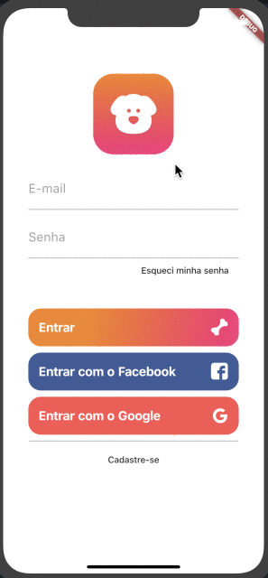
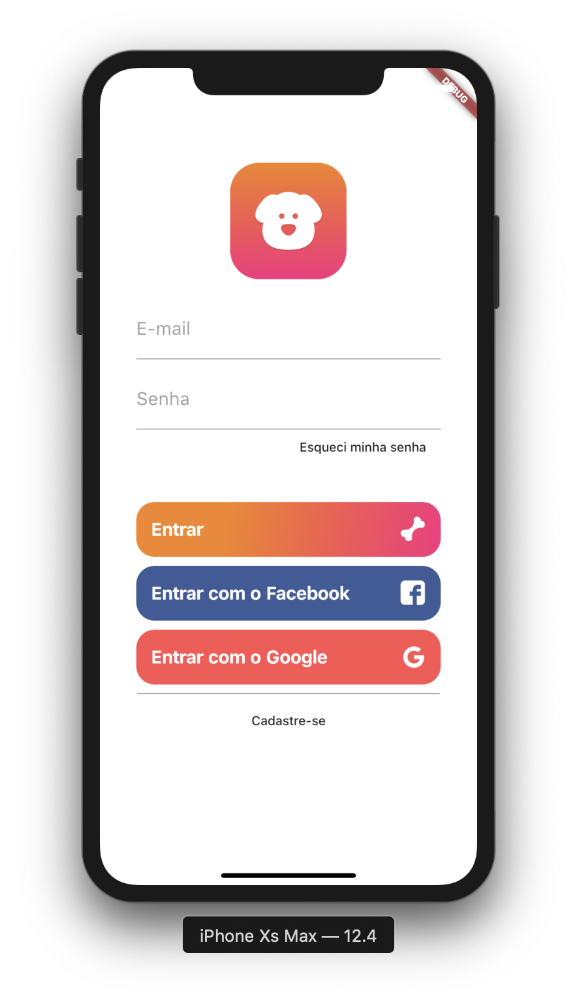
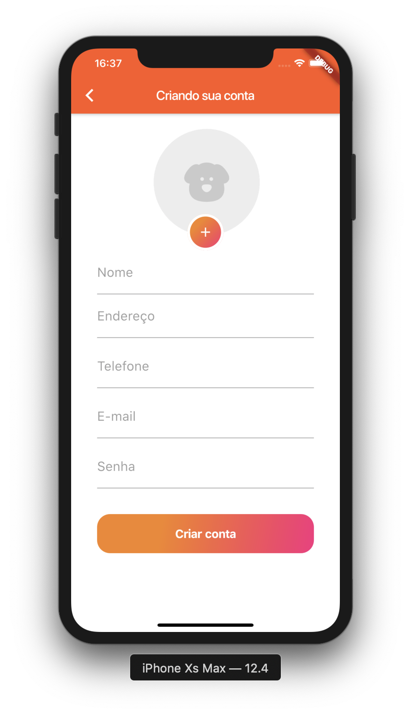
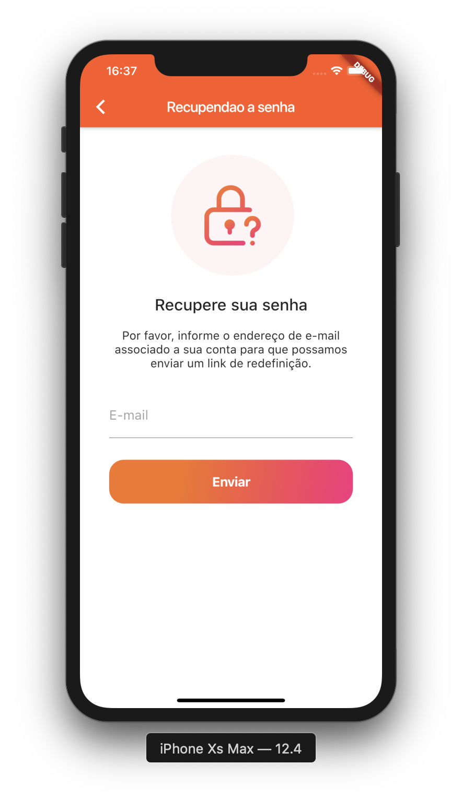

# Login Screen #

> A new Flutter project.

> Projeto criado com **Flutter** :heart:.

> Login Screen *Example* *only*

> You can **fork** this project

> Inspirado no prejto criado por 
[Balta.io](https://www.youtube.com/watch?v=Rc_GJpRU6VI&list=PLHlHvK2lnJndc8qCqmQdHr-cLoOb2-q61)

[
 

  
  
  

## Change Log ##

Nothing changed at same

## Version 1.0.0 ##

## Features ##

Login button with acount and Facebook implemented.
Screens for SignUp, Reset Password and Application Home done.

## License ##

[GNU License](https://www.gnu.org/licenses/lgpl-3.0.html)
[MIT License](https://opensource.org/licenses/MIT)

## Getting Started  Witth Flutter ##

This project is a starting point for a Flutter application.

A few resources to get you started if this is your first Flutter project:

- [Lab: Write your first Flutter app](https://flutter.dev/docs/get-started/codelab)
- [Cookbook: Useful Flutter samples](https://flutter.dev/docs/cookbook)

For help getting started with Flutter, view our
[online documentation](https://flutter.dev/docs), which offers tutorials,
samples, guidance on mobile development, and a full API reference.
